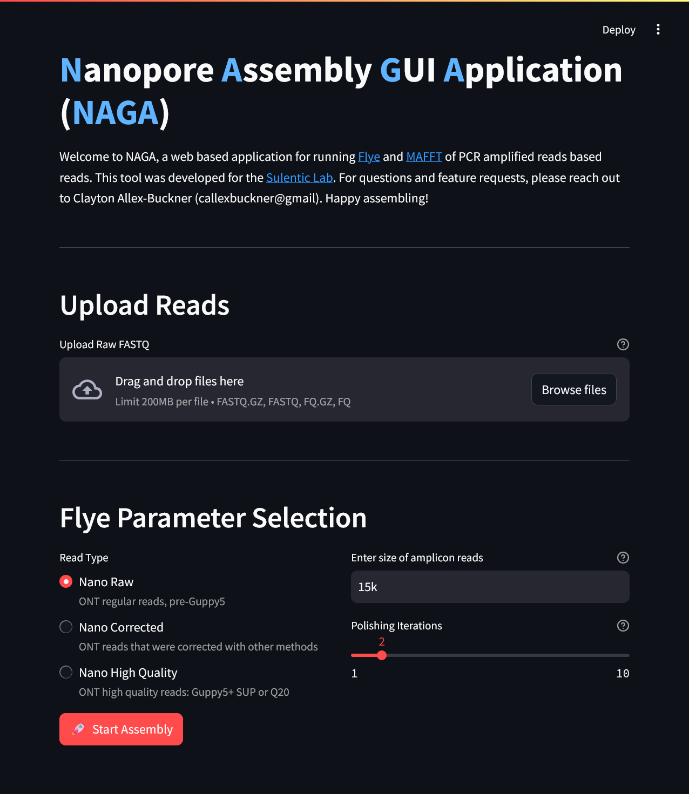

<a id="readme-top"></a>

<!-- INDEX -->
<details>
    <summary>Index</summary>
    <ol>
    <li>
        <a href="#about">About</a>
    </li>
    <li>
        <a href="#built-with">Built With</a>
    </li>
    <li>
        <a href="#getting-started">Getting Started</a>
        <ul>
            <li>
                <a href="#installation">Installation</a>
            </li>
        </ul>
    </li>
    <li>
        <a href="#usage">Usage</a>
    </li>
    <li>
        <a href="#roadmap">Roadmap</a>
    </li>
    <li>
        <a href="#developers">Developers</a>
    </li>
    </ol>
</details>

# About
<b>Nanopore Assembly Gui Application</b> (NAGA) is a streamlit app for basic nanopore assembly of amplicons for the Sulentic Lab. NAGA allows the user to upload nanopore reads and run [Flye](https://github.com/mikolmogorov/Flye) assembly with tuneable parameters. 

<b>NAGA IS STILL UNDER DEVELOPMENT AND SOME FEATURES ARE STILL BEING TESTED</b>

## Built With
[![Python][Python]][Python-url]
[![Streamlit][Streamlit]][Streamlit-url]
<p align="right">(<a href="#readme-top">back to top</a>)</p>

## Getting Started
Set up of <b>NAGA</b> is simplified through the provided <i><b>Makefile</i></b>. Installation may also be completed through `pip`, but all dependencies will need to be manually pulled.
<p align="right">(<a href="#readme-top">back to top</a>)</p>

### Installation
Installation via the <i><b>Makefile</i></b> requires [GNU Make](https://www.gnu.org/software/make/). 
To install via <b>make</b>

```bash
git clone https://github.com/CAllex-Buckner/naga.git
cd naga
make install
```

## Usage
<b>NAGA</b> allows you to upload multiple raw ONT FASTQ files throuugh the web interface and modify several of the FLYE parameters. The below image is the current web page iteration, and will be updated as more features are added.


<p align="right">(<a href="#readme-top">back to top</a>)</p>

## Roadmap

- [x] Makefile for automated installation
- [x] Framework for Flye Assembly
- [ ] Backend Flye Functionality
- [ ] MAFFT Alignment Page
- [ ] Backend MAFFT Functionality
- [ ] Assembly Stats Visualization
- [ ] Alignment Visualization
<p align="right">(<a href="#readme-top">back to top</a>)</p>

## Developers
- [Clayton Allex-Buckner](https://github.com/CAllex-Buckner)
<p align="right">(<a href="#readme-top">back to top</a>)</p>


[Python]: https://img.shields.io/badge/python-3670A0?style=for-the-badge&logo=python&logoColor=ffdd54
[Python-url]: https://www.python.org/

[Streamlit]: https://img.shields.io/badge/-Streamlit-FF4B4B?style=flat&logo=streamlit&logoColor=white
[Streamlit-url]: https://streamlit.io/